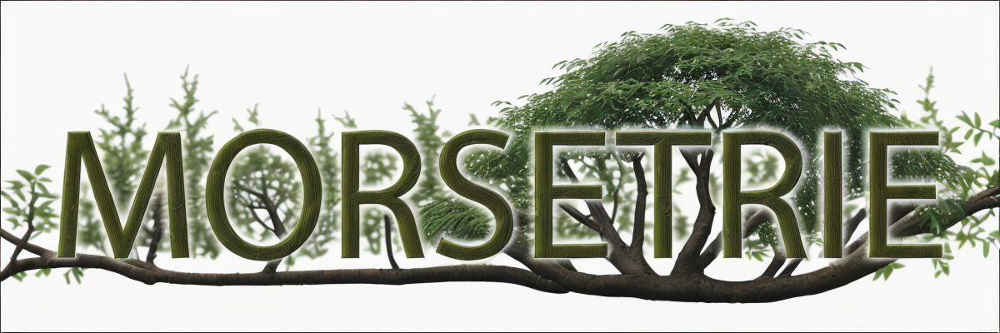
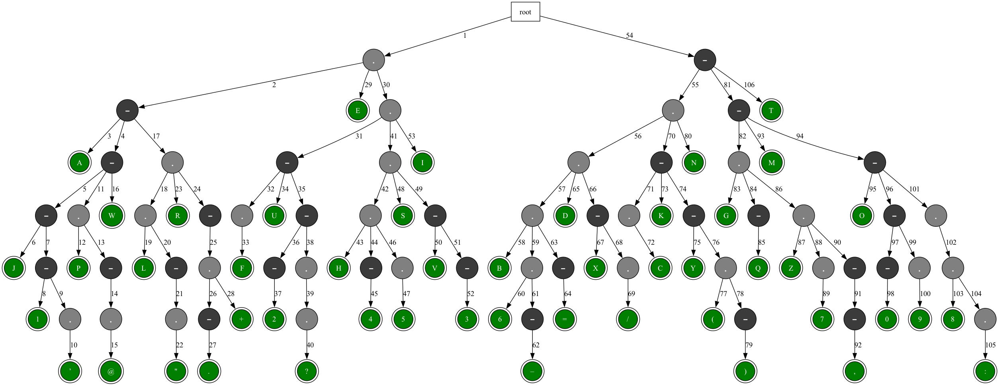

<!-- markdownlint-disable no-emphasis-as-heading no-hard-tabs no-inline-html -->
# morsetrie

<div align="center">




[](https://app.codacy.com/gh/pierow2k/morsetrie/dashboard?utm_source=gh&utm_medium=referral&utm_content=&utm_campaign=Badge_grade)

**morsetrie is a Go Package for Lightning Fast Morse Code Decoding**

</div>

<!-- TABLE OF CONTENTS -->
<details closed="closed">
<summary><h2 style="display: inline-block">Table of Contents</h2></summary>

- [Overview](#overview)
  - [What it does](#what-it-does)
  - [Why a trie?](#why-a-trie)
- [Usage](#usage)
  - [Simple example](#simple-example)
- [Error handling behavior](#error-handling-behavior)
- [Contributing](#contributing)
- [License](#license)

</details>

## Overview

`morsetrie` is a small, lightning fast Morse code decoder built around a
compact [trie](https://en.wikipedia.org/wiki/Trie) data structure. It turns
sequences of dots and dashes into text by walking a pre-built decoding
tree, making decoding efficient and predictable even for long inputs.

The package ships with a static trie based on the International
Telecommunication Union (ITU)
[M.1677](https://www.itu.int/rec/R-REC-M.1677-1-200910-I/) recommendation
for International Morse code, which includes letters, digits, and common
punctuation.

### What it does

- Decodes `.` and `-` into runes using a trie-based lookup.
- Uses whitespace (`space`, `tab`, `newline`, `\r`) to delimit characters.
- Treats `/` as a word separator and emits a space in the decoded output.
- Represents unknown or invalid Morse sequences as `?` (rather than failing
mid-stream).

### Why a trie?

A trie is a natural fit for Morse: each dot/dash is a step down the tree.
This avoids repeatedly scanning a table or building strings for lookups.
Internally the implementation is **array-backed** and uses **int16 child
indices** to keep memory usage low while remaining cache-friendly.



## Usage

Refer to the package documentation on [pkg.go.dev](https://pkg.go.dev/github.com/pierow2k/morsetrie).

### Simple example

```go
package main

import (
    "fmt"

    "github.com/pierow2k/morsetrie"
)

func main() {
    // Define the Morse code string to decode.
    morseCode := "- .... .. ... / .. ... / -- --- .-. ... . - .-. .. ."

    // The Decode function will use the static trie to decode.
    text, err := morsetrie.Decode(morseCode)
        if err != nil {
            panic(err)
    }

    // Print the decoded text.
    fmt.Println(text)
}
```

**Output**

```text
THIS IS MORSETRIE
```

## Error handling behavior

- If the input contains unsupported characters (anything other than `.`,
`-`, `/`, or whitespace), decoding fails with `ErrUnexpectedChar`.
- If the input contains a syntactically valid but unknown Morse sequence,
the decoder emits `?` for that symbol and continues.

## Contributing

- Add a star to the
[morsetrie GitHub repository](https://github.com/pierow2k/morsetrie)
- Have an idea for a new feature or noticed something that isn’t working
quite right? [Open an issue](https://github.com/pierow2k/morsetrie/issues)
- If you’ve made improvements or fixed a bug, [submit a pull
request](https://www.github.com/pierow2k/morsetrie/pulls)

## License

morsetrie is distributed under the MIT License. See the
[LICENSE](LICENSE) file for more details.
